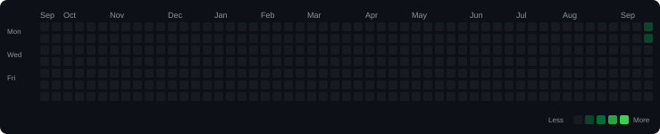

# ⚡ Coding Solutions Portfolio

> Automatically organized, analyzed, and updated by **CodeSyncVault**.

---

## 📊 Overview

| Metric | Count |
| --- | ---: |
| 🏆 Total Solved | 6 |
| 🔵 Basic | 0 |
| 🟢 Easy | 0 |
| 🟠 Medium | 5 |
| 🔴 Hard | 1 |

## 📈 Progress

| Difficulty | Progress | Solved |
| --- | --- | ---: |
| 🔵 Basic | ░░░░░░░░░░░░░░░░░░░░ 0% | 0/6 |
| 🟢 Easy | ░░░░░░░░░░░░░░░░░░░░ 0% | 0/6 |
| 🟠 Medium | █████████████████░░░ 83% | 5/6 |
| 🔴 Hard | ███░░░░░░░░░░░░░░░░░ 17% | 1/6 |

## 🔥 Coding Activity

## 🧩 Pattern & Topic Index

| Pattern | Problems |
| --- | ---: |
| [Hash Map](patterns/Hash%20Map.md) | 1 |

| Topic | Problems |
| --- | ---: |
| [Array](topics/Array.md) | 3 |
| [Hashing](topics/Hashing.md) | 1 |

## 💻 Languages

| Language | Problems |
| --- | ---: |
| Java | 6 |

## 🌐 Platforms

| Platform | Problems |
| --- | ---: |
| gfg | 3 |
| LeetCode | 3 |

## 🕒 Recently Solved

| Problem | Difficulty | Language | Platform |
| --- | --- | --- | --- |
| [Pyramid Array with Reduce Operations](gfg/Java/Medium/Pyramid-Array-with-Reduce-Operations/README.md) | Medium | Java | gfg |
| [Minimum Operations to Reduce X to Zero](LeetCode/Java/medium/Minimum-Operations-to-Reduce-X-to-Zero/README.md) | Medium | Java | LeetCode |
| [Longest Matching in Dictionary with Removals](gfg/Java/Medium/Longest-Matching-in-Dictionary-with-Removals/README.md) | Medium | Java | gfg |
| [Find X Value of Array II](LeetCode/Java/hard/Find-X-Value-of-Array-II/README.md) | Hard | Java | LeetCode |
| [Find X Value of Array I](LeetCode/Java/medium/Find-X-Value-of-Array-I/README.md) | Medium | Java | LeetCode |
| [Maximum Subset XOR](gfg/Java/Medium/Maximum-Subset-XOR/README.md) | Medium | Java | gfg |

## 🗂 Repository

- 📚 [Solution Index](.codevault/index.json)
- 🧩 [Patterns](patterns/)
- 📚 [Topics](topics/)

---

### 🤖 Powered by CodeSyncVault

This README is generated automatically from the CodeSyncVault repository index.
