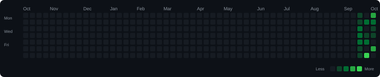

# ⚡ Coding Solutions Portfolio

> Automatically organized, analyzed, and updated by **CodeSyncVault**.

[](docs/AllProblems.md) [](docs/Basic.md) [](docs/Easy.md) [](docs/Medium.md) [](docs/Hard.md) [](https://github.com/vivekkushwahaofficial/CodeSyncVault)

---

## 📑 Table of Contents

- [📚 Solution Documentation](#-solution-documentation)
- [📈 Detailed Statistics](#-detailed-statistics)
- [⚙️ Workflow & Automation](#️-workflow--automation)
- [🗂 Repository](#-repository)

## 📊 Overview

| Metric | Count |
| --- | ---: |
| 🏆 Total Solved | 31 |
| 🔵 Basic | 0 |
| 🟢 Easy | 7 |
| 🟠 Medium | 18 |
| 🔴 Hard | 6 |

## 📈 Progress

| Difficulty | Progress | Solved |
| --- | --- | ---: |
| 🔵 Basic | ░░░░░░░░░░░░░░░░░░░░ 0% | 0/31 |
| 🟢 Easy | █████░░░░░░░░░░░░░░░ 23% | 7/31 |
| 🟠 Medium | ████████████░░░░░░░░ 58% | 18/31 |
| 🔴 Hard | ████░░░░░░░░░░░░░░░░ 19% | 6/31 |

## 🔥 Coding Activity



## 🧩 Pattern Index

| Pattern | Problems |
| --- | ---: |
| [Stack](patterns/Stack.md) | 5 |
| [Hash Map](patterns/Hash%20Map.md) | 4 |
| [Sorting](patterns/Sorting.md) | 2 |
| [Greedy](patterns/Greedy.md) | 1 |

## 📚 Topic Index

| Topic | Problems |
| --- | ---: |
| [Stack](topics/Stack.md) | 7 |
| [Math](topics/Math.md) | 6 |
| [Array](topics/Array.md) | 5 |
| [String](topics/String.md) | 4 |
| [Hashing](topics/Hashing.md) | 1 |
| [Linked List](topics/Linked%20List.md) | 1 |
| [Tree](topics/Tree.md) | 1 |

## 💻 Languages

| Language | Problems |
| --- | ---: |
| Java | 31 |

## 🌐 Platforms

| Platform | Problems |
| --- | ---: |
| LeetCode | 16 |
| GeeksforGeeks | 15 |

## 🕒 Recently Solved

| Problem | Difficulty | Language | Platform | Date |
| --- | --- | --- | --- | --- |
| [Minimum Insertions to Balance a Parentheses String](LeetCode/Java/medium/Minimum-Insertions-to-Balance-a-Parentheses-String/README.md) | Medium | Java | LeetCode | 2026-10-09 |
| [Maximum Product of Three Numbers](LeetCode/Java/easy/Maximum-Product-of-Three-Numbers/README.md) | Easy | Java | LeetCode | 2026-10-09 |
| [Maximum Product of Two Elements in an Array](LeetCode/Java/easy/Maximum-Product-of-Two-Elements-in-an-Array/README.md) | Easy | Java | LeetCode | 2026-10-09 |
| [Max Path Sum Between Two Leaves](gfg/Java/Hard/Max-Path-Sum-Between-Two-Leaves/README.md) | Hard | Java | GeeksforGeeks | 2026-10-07 |
| [Minimum Add to Make Parentheses Valid](LeetCode/Java/medium/Minimum-Add-to-Make-Parentheses-Valid/README.md) | Medium | Java | LeetCode | 2026-10-06 |
| [Your Social Network](gfg/Java/Medium/Your-Social-Network/README.md) | Medium | Java | GeeksforGeeks | 2026-10-05 |
| [Score of Parentheses](LeetCode/Java/medium/Score-of-Parentheses/README.md) | Medium | Java | LeetCode | 2026-10-05 |
| [Smallest Palindromic Rearrangement II](LeetCode/Java/hard/Smallest-Palindromic-Rearrangement-II/README.md) | Hard | Java | LeetCode | 2026-10-04 |
| [Minimum Number of Pushes to Type Word I](LeetCode/Java/easy/Minimum-Number-of-Pushes-to-Type-Word-I/README.md) | Easy | Java | LeetCode | 2026-10-04 |
| [Parenthesis Checker](gfg/Java/Easy/Parenthesis-Checker/README.md) | Easy | Java | GeeksforGeeks | 2026-10-04 |

## 📚 Solution Documentation

| Resource | Description |
| --- | --- |
| 📚 [All Problems](docs/AllProblems.md) | Complete solution index |
| 🔵 [Basic](docs/Basic.md) | Basic difficulty solutions |
| 🟢 [Easy](docs/Easy.md) | Easy difficulty solutions |
| 🟠 [Medium](docs/Medium.md) | Medium difficulty solutions |
| 🔴 [Hard](docs/Hard.md) | Hard difficulty solutions |
| 🧩 [Patterns](patterns/) | Problems grouped by solving pattern |
| 📚 [Topics](topics/) | Problems grouped by topic |

## 📈 Detailed Statistics

Explore the complete repository analytics including:

- Difficulty distribution
- Platform distribution
- Language usage
- Pattern distribution
- Topic distribution

➡️ **[View Detailed Statistics](stats/progress.md)**

## ⚙️ Workflow & Automation

CodeSyncVault automatically keeps this repository organized:

```text
Accepted Solution
       ↓
Metadata Extraction
       ↓
Pattern & Topic Analysis
       ↓
Solution Packaging
       ↓
GitHub Sync
       ↓
Repository Index Update
       ↓
README & Documentation Regeneration
```

No manual statistics or documentation maintenance is required.

## 🗂 Repository

| Resource | Purpose |
| --- | --- |
| 📚 [.codevault/index.json](.codevault/index.json) | Repository source of truth |
| 🔥 [.codevault/activity.svg](.codevault/activity.svg) | Coding activity heatmap |
| 🧩 [patterns/](patterns/) | Pattern-based indexes |
| 📚 [topics/](topics/) | Topic-based indexes |
| 📖 [docs/](docs/) | Difficulty & problem documentation |
| 📈 [stats/](stats/) | Repository statistics |

---

### 🤖 Powered by CodeSyncVault

This README and the repository documentation are generated automatically from the CodeSyncVault repository index.
